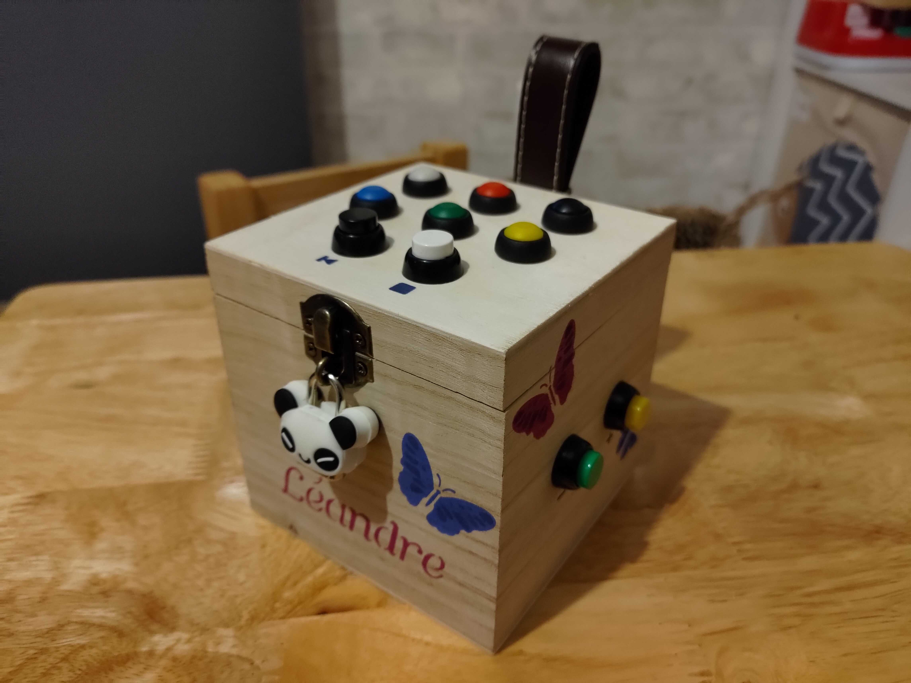
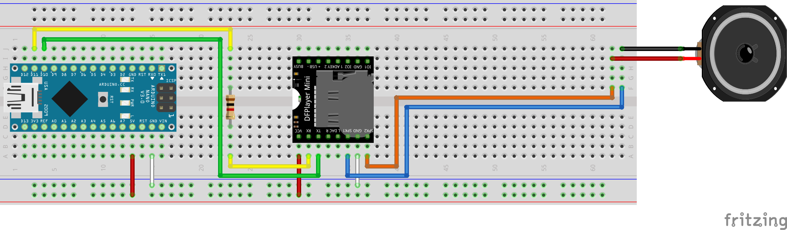

# MP3 Player

This project contains the source code of the MP3 player that I've built for the second christmas of my son.

The player contains 6 buttons to select a playlist, a stop button, a previous button, 2 buttons for the volume and a power button.

## Electronic

The player is based on an Arduino Mini and a DFPlayer Mini (actually, I received a copy based on a MH2024K-16SS chip).

The buttons are not represented on this schema but they are connected to the following pins:
- volume down: B2
- volume up: B3
- playlists: B4 to B9
- previous: B12
- stop: A0

## Software

The control of the DFPlayer is done using the library [DFMiniMp3](https://github.com/Makuna/DFMiniMp3).